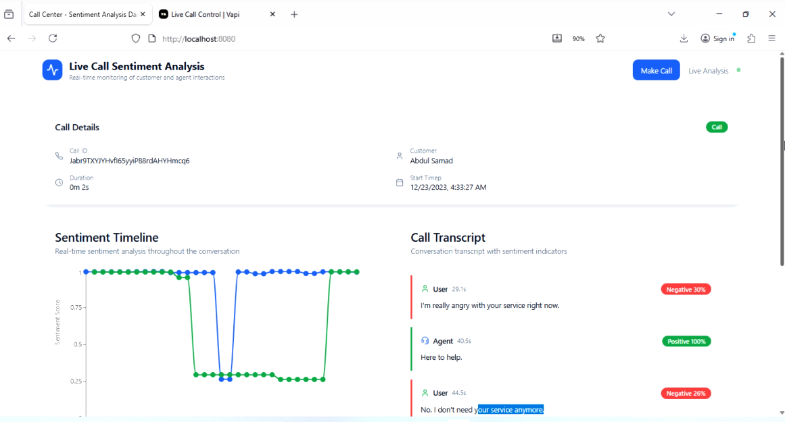

# 📞 Voice Applications Dashboard with Vapi, FastAPI, Deepgram, and Real-Time Emotion Analysis

This project implements a complete voice applications system built with a TypeScript React.js dashboard and a FastAPI WebSocket backend. It integrates both the Vapi Web SDK and Server SDK to manage real-time call interactions, audio streaming, transcription, and intelligent sentiment-driven call routing.

The system provides end-to-end capabilities for monitoring, analyzing, and managing AI-powered voice agent calls in real time.

## Overview

The project enables real-time voice interfaces using Vapi's infrastructure and exposes a dashboard that allows call monitoring, AI agent oversight, and outbound call triggering. The backend maintains persistent WebSocket connections to stream audio, process transcription, and run emotion classification on live conversations.

## Key Features

### Vapi Call Management

The system integrates directly with Vapi’s Web and Server SDKs to enable AI voice agent operations such as:

* Handling incoming and outgoing calls.
* Server-side call control and event processing.
* Triggering outbound calls from the React.js dashboard.
* Listening to live call audio through Vapi’s Call Listen feature.

### Real-Time Audio Streaming and Transcription
Vapi reference: [https://docs.vapi.ai/calls/call-features](https://docs.vapi.ai/calls/call-features)
Live call audio is streamed from Vapi through WebSocket connections. The backend processes the audio stream with Deepgram, converting raw audio into real-time transcriptions that are immediately available in the dashboard for analysis and monitoring.

### Real-Time Emotion Classification

The system uses the Hugging Face emotion classifier model from Michelle Jie Li.
Model reference: [https://huggingface.co/michellejieli/emotion_text_classifier](https://huggingface.co/michellejieli/emotion_text_classifier)

Each transcription is analyzed and classified into six possible emotion categories:
anger, disgust, fear, joy, neutral, sadness, surprise.

Emotion scores are evaluated continuously during the call. When negative emotions such as anger, disgust, or sadness dominate, the system triggers automatic call handling actions.

### Automatic Call Transfer

Based on emotion detection and predefined thresholds, the backend can initiate a call transfer from the AI agent to a human assistant. This ensures that customers experiencing frustration or negative sentiment are routed to a real support representative for better service outcomes.

## Architecture

### Frontend (React + TypeScript)

* Dashboard for live call monitoring.
* Outbound call initiation using Vapi Web SDK.
* Real-time transcription and sentiment view.
* WebSocket connection to the backend for streaming updates.

### Backend (FastAPI + WebSocket)

* WebSocket endpoints for relaying call audio events and analysis results.
* Integration with Vapi Server SDK for call control and listening.
* Deepgram voice diarization and transcription pipeline.
* Hugging Face emotion classifier for sentiment analysis.
* Logic for triggering call transfers based on emotional states.

## Workflow

1. The dashboard initiates or monitors calls using the Vapi Web SDK.
2. The backend connects to Vapi using the Server SDK to receive live audio through Call Listen.
3. Audio is streamed via WebSocket to the backend.
4. The backend processes the stream with Deepgram to generate real-time diarization and transcripts.
5. Transcripts are classified using the emotion classifier model.
6. Analysis results are pushed to the frontend dashboard for real-time display.
7. If the detected sentiment crosses a negative threshold, the system automatically transfers the call to a human agent.

## Technologies Used

* React.js with TypeScript
* FastAPI with WebSockets
* Vapi Web SDK
* Vapi Server SDK
* Deepgram Speech-to-Text
* Hugging Face Transformers
* Emotion Text Classifier Model
* Real-Time Streaming Pipelines

## Purpose

This project demonstrates how to build intelligent, real-time voice applications capable of monitoring live calls, analyzing customer sentiment, and making automated decisions that enhance customer experience. It combines modern speech processing, AI-driven emotion detection, and robust call management using Vapi’s platform.

